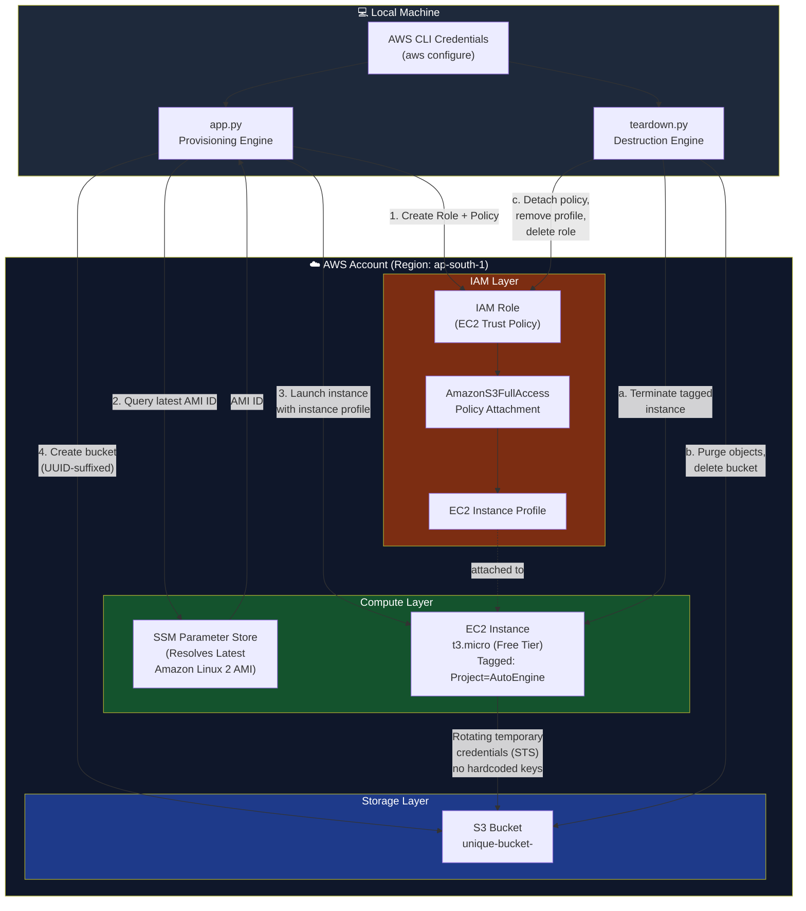

# AWS Infrastructure Automation Engine 🚀

An enterprise-grade, fully automated **Infrastructure-as-Code (IaC)** provisioning and lifecycle destruction engine built entirely with Python and the **AWS Boto3 SDK**.

This project bypasses the manual AWS Management Console entirely, demonstrating programmatic cloud orchestration, dynamic resource lifecycle management, and tokenless identity access boundaries.


---

## 📋 Table of Contents

- [Overview](#-overview)
- [Architecture Diagram](#️-architecture-diagram)
- [Provisioning Lifecycle](#1-provisioning-lifecycle-apppy)
- [Teardown Lifecycle](#2-teardown-lifecycle-teardownpy)
- [Production Use Case](#-production-use-case)
- [Tech Stack & Dependencies](#️-tech-stack--dependencies)
- [Project Structure](#-project-structure)
- [IAM Policy Reference](#-iam-policy-reference)
- [Setup & Execution](#-setup--execution)
- [Configuration](#️-configuration)
- [Security Considerations](#-security-considerations)
- [Cost Management](#-cost-management)
- [Troubleshooting](#-troubleshooting)
- [Roadmap](#️-roadmap)

---

## 🔍 Overview

Manual cloud environment configuration introduces severe human configuration errors, security openings, and **"configuration drift."** The AWS Infrastructure Automation Engine provides full **structural idempotency** — a repeatable, scriptable path from zero to a running, secured sandbox environment, and back to zero again.

Run `app.py` once to receive a fully functional, secured machine-and-storage framework in seconds. Run `teardown.py` when you're done to strip every provisioned resource cleanly out of your account, keeping AWS billing at exactly zero.

---

## 🏗️ Architecture Diagram



**Flow summary:**
1. `app.py` authenticates using local AWS CLI credentials.
2. An IAM Role + Instance Profile is created and attached with the `AmazonS3FullAccess` policy.
3. SSM Parameter Store is queried live for the latest Amazon Linux 2 AMI ID.
4. A `t3.micro` EC2 instance is launched with the instance profile attached and custom project tags.
5. A globally-unique, UUID-suffixed S3 bucket is provisioned.
6. The EC2 instance authenticates to S3 using short-lived, auto-rotating STS credentials via the instance profile — **no access keys are ever hardcoded**.
7. `teardown.py` reverses the entire chain: terminate compute → purge and delete storage → detach and delete IAM resources.

---

### 1. Provisioning Lifecycle (`app.py`)

- **Dynamic Object Storage:** Automatically provisions a globally unique Amazon S3 bucket. Appends a dynamic hex UUID to the bucket identifier to completely eliminate global naming collisions.
- **Tokenless Identity Boundary:** Assembles an IAM Role and couples it to an EC2 Instance Profile with `AmazonS3FullAccess` authorization. This allows the compute server to talk directly to the storage container using rotating internal cryptographic tokens (via AWS STS) — eliminating the security risk of hardcoded AWS Access Keys.
- **SSM-Managed Compute:** Programmatically queries the public AWS Systems Manager (SSM) Parameter Store to resolve the latest stable Amazon Linux 2 AMI ID live, booting it instantly on a Free Tier eligible `t3.micro` EC2 node mapped with custom project tags.

### 2. Teardown Lifecycle (`teardown.py`)

- **Targeted Compute Termination:** Scans the active region, identifies the custom tagged compute resource, and securely executes a termination sequence.
- **Force-Purge Storage Scrubbing:** S3 buckets cannot be deleted while containing data. The destruction script systematically targets the automated bucket, purges all stored objects (including versioned objects, if versioning is enabled), and strips down the bucket resource.
- **IAM De-provisioning:** Seamlessly detaches operational security policies from the identity container, removes the role from the instance profile, deletes the instance profile, and scrubs the IAM role cleanly from your global account dashboard.

---

## 🎯 Production Use Case

If a DevOps or engineering group requires a clean, completely secure sandbox environment to run background automated parsing pipelines, they run this script once. They receive a fully functional, secured machine-and-storage framework in seconds, and can tear it completely down at the end of the operation using the teardown routine — keeping AWS cloud billing down to exactly zero.

Typical scenarios:
- Ephemeral CI/CD test environments
- On-demand data processing sandboxes
- Training/demo environments that must not persist
- Security testing of least-privilege IAM boundaries

---

## 🛠️ Tech Stack & Dependencies

| Category | Technology |
|---|---|
| Language | Python 3.x |
| Cloud SDK | AWS Boto3 |
| Identity | AWS IAM (Roles, Instance Profiles, Managed Policies) |
| Storage | Amazon S3 |
| Compute | Amazon EC2 (`t3.micro`, Free Tier eligible) |
| AMI Resolution | AWS Systems Manager (SSM) Parameter Store |
| Credential Model | AWS STS (temporary, auto-rotating tokens) |

---

## 📁 Project Structure

```
aws-infra-automation-engine/
│
├── app.py                 # Provisioning entry point
├── teardown.py             # Destruction entry point
├── config.py                # Region, tags, instance type, bucket prefix constants
├── requirements.txt          # Python dependencies (boto3, etc.)
├── utils/
│   ├── iam_helpers.py        # Role/policy/instance profile creation & cleanup
│   ├── s3_helpers.py          # Bucket creation, object purge, bucket deletion
│   └── ec2_helpers.py          # AMI resolution, instance launch, termination
└── README.md
```

---

## 🔐 IAM Policy Reference

The provisioning engine creates a trust policy allowing EC2 to assume the automation role, then attaches the AWS-managed `AmazonS3FullAccess` policy.

**Trust Relationship:**
```json
{
  "Version": "2012-10-17",
  "Statement": [
    {
      "Effect": "Allow",
      "Principal": { "Service": "ec2.amazonaws.com" },
      "Action": "sts:AssumeRole"
    }
  ]
}
```

**Attached Managed Policy:** `arn:aws:iam::aws:policy/AmazonS3FullAccess`

> ⚠️ For production hardening, replace `AmazonS3FullAccess` with a scoped custom policy limited to the specific bucket ARN created by the engine (see [Roadmap](#️-roadmap)).

---

## 🚀 Setup & Execution

### Prerequisites

1. Ensure your local machine has active credentials configured via the AWS CLI:
   ```bash
   aws configure
   ```
2. Install the target Python library:
   ```bash
   pip install boto3
   ```
   Or, if using `requirements.txt`:
   ```bash
   pip install -r requirements.txt
   ```

### Provision Infrastructure

```bash
python app.py
```

Expected console telemetry:
```
[+] Resolving latest Amazon Linux 2 AMI via SSM...
[+] AMI resolved: ami-xxxxxxxxxxxxxxxxx
[+] Creating IAM Role: AutoEngineRole...
[+] Attaching policy: AmazonS3FullAccess...
[+] Creating Instance Profile...
[+] Creating S3 Bucket: autoengine-bucket-<uuid>...
[+] Launching EC2 instance (t3.micro)...
[+] Instance running: i-xxxxxxxxxxxxxxxxx
[✓] Provisioning complete.
```

### Destroy Infrastructure

```bash
python teardown.py
```

Expected console telemetry:
```
[+] Locating tagged EC2 instance...
[+] Terminating instance: i-xxxxxxxxxxxxxxxxx...
[+] Purging objects from S3 bucket...
[+] Deleting S3 bucket...
[+] Detaching IAM policy...
[+] Removing role from instance profile...
[+] Deleting instance profile...
[+] Deleting IAM role...
[✓] Teardown complete. Billing surface reduced to zero.
```

---

## ⚙️ Configuration

Key parameters typically exposed in `config.py`:

| Variable | Description | Default |
|---|---|---|
| `AWS_REGION` | Target deployment region | `ap-south-1` |
| `INSTANCE_TYPE` | EC2 instance size | `t3.micro` |
| `BUCKET_PREFIX` | Prefix for generated bucket names | `autoengine-bucket` |
| `PROJECT_TAG` | Tag applied to all resources for teardown discovery | `AutoEngine` |

---

## 🛡️ Security Considerations

- **No hardcoded credentials** on the EC2 instance — access is brokered entirely through STS-issued, auto-rotating temporary tokens via the instance profile.
- **Least privilege recommended:** `AmazonS3FullAccess` is broad by default; scope it down to the specific bucket ARN for production use.
- **Resource tagging** ensures the teardown script only targets resources created by this engine, avoiding accidental deletion of unrelated infrastructure.
- Always verify `teardown.py` completes successfully — check the AWS Console or run `aws s3 ls` / `aws ec2 describe-instances` to confirm zero residual resources.

---

## 💰 Cost Management

- The EC2 instance defaults to `t3.micro`, which is **Free Tier eligible** for new AWS accounts (750 hours/month for 12 months).
- S3 storage costs apply only to data actually stored in the bucket while it exists.
- Running `teardown.py` promptly after use is the primary mechanism for keeping spend at zero — nothing in this engine is designed to persist.

---

## 🧩 Troubleshooting

| Issue | Likely Cause | Fix |
|---|---|---|
| `BucketAlreadyExists` | Extremely rare UUID collision or leftover bucket from a failed teardown | Re-run `app.py`; check for orphaned buckets manually |
| `AccessDenied` on IAM calls | Local CLI credentials lack IAM permissions | Ensure your IAM user/role has `iam:CreateRole`, `iam:AttachRolePolicy`, etc. |
| EC2 instance stuck in `pending` | Regional capacity or AMI mismatch | Re-verify the resolved AMI ID is valid for your account/region |
| Teardown can't delete bucket | Bucket still contains objects (e.g., versioned objects) | Ensure `teardown.py` purge step handles object versions, not just current objects |

---

## 🗺️ Roadmap

- [ ] Replace `AmazonS3FullAccess` with a least-privilege, bucket-scoped custom IAM policy
- [ ] Add CloudFormation/Terraform export option alongside the Boto3 engine
- [ ] Support multi-region provisioning
- [ ] Add dry-run mode for both `app.py` and `teardown.py`
- [ ] Add automated cost estimation output before provisioning

---

## 📄 License

This project is licensed under the MIT License.
